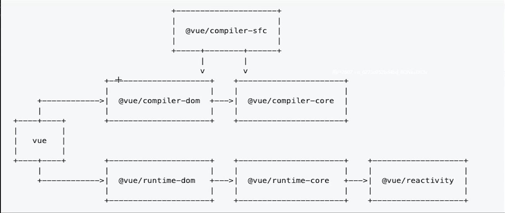

# Vue 源码全解析

## 整体Vue解析

## @vue/compiler-sfc

把 `sfc` 文件转换成 `js` 文件 例如 `rollup-plugin-vue` 里面用的就是 `@vue/compiler-sfc` 

## @vue/compiler-dom && @vue/compiler-core

把 `template` 转换成 `render` 函数

## @vue/runtime-dom && @vue/runtime-core

`runtime-core` 内部所有函数最终会从 `runtime-dom` 中导出
